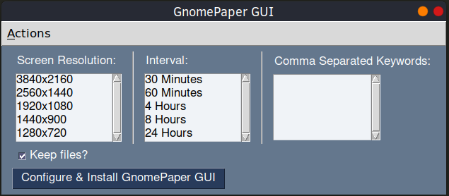

# GnomePaper GUI

A clone of the [GnomePaper](https://gitlab.com/joerismissaert/gnomepaper) application refactored with a Graphical User Interface using PySimpleGUI.

## Getting Started

Clone the respository and run `python3 -m pip install -r requirements.txt` to install dependencies.  
Install the Python Tkinter OS Package:
	* `apt install python3-tk`
	* `dnf install python3-tkinter`

Run  `gp-gui.py` as a regular user:
* `chmod +x gp-gui.py && ./gp-gui.py`
or
* `python3 gp-gui.py`


The GUI:
* writes the user provided variables to `config.py`. When the application is executed this file is read.
* moves the `app.py` and `config.py` files to `~/.local/bin/gnomepaper-gui/`.
* moves the `gnomepaper-gui.timer` Systemd Timer unit and `gnomepaper-gui.service` Systemd Service unit to `~/.config/systemd/user`.
* enables the Systemd Timer unit.

You can reconfigure the application by running the GUI again. 



### Usage
After installing using the `Configure & Install GnomePaper GUI` button, the app will automatically run at the specified interval.
There's no need to run the GUI again, unless you wish to reconfigure a setting or set a one time random image.

You can check the next run using `systemctl --user list-timers gnomepaper-gui.timer`

```
[joeri@Ryzen7 ~]$ systemctl --user list-timers gnomepaper-gui.timer
NEXT                        LEFT       LAST                        PASSED    UNIT                 ACTIVATES             
Thu 2020-09-03 17:00:00 +04 13min left Thu 2020-09-03 16:30:37 +04 16min ago gnomepaper-gui.timer gnomepaper-gui.service
```

Alternatively,  you can set a one time random image using `Set Random Image` in the Actions menu. 

### Uninstallation
Execute the GUI and select Uninstall Service from the Actions menu.


### Prerequisites
* Tested with `Python 3.8.5` on Fedora 32 using Gnome Shell 3.36.5.
* You need to have the Python Tkinter OS package installed:
  * `apt install python3-tk`
  * `dnf install python3-tkinter`
* You need the `PySimpleGUI` and `requests` Python module: `python3 -m pip install PySimpleGUI requests`
